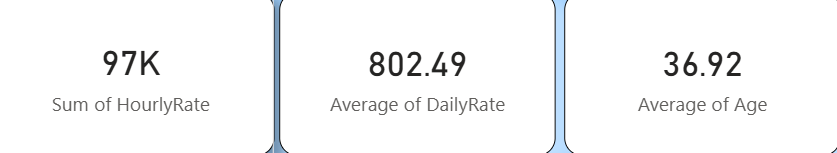
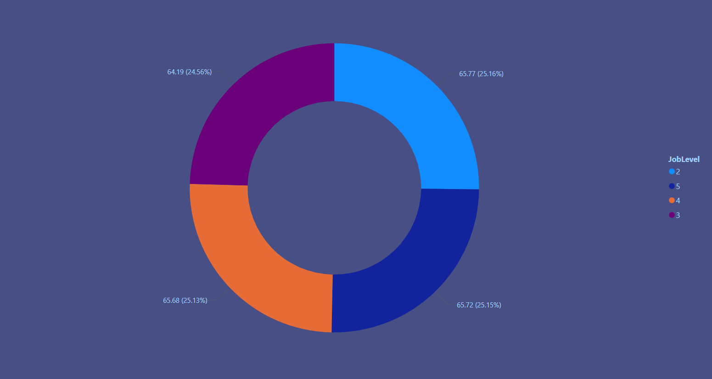
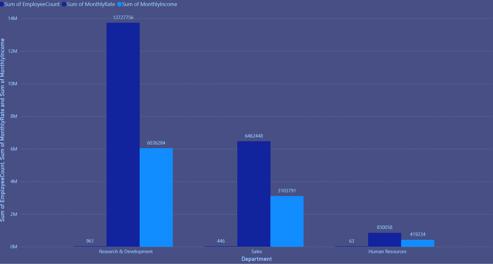
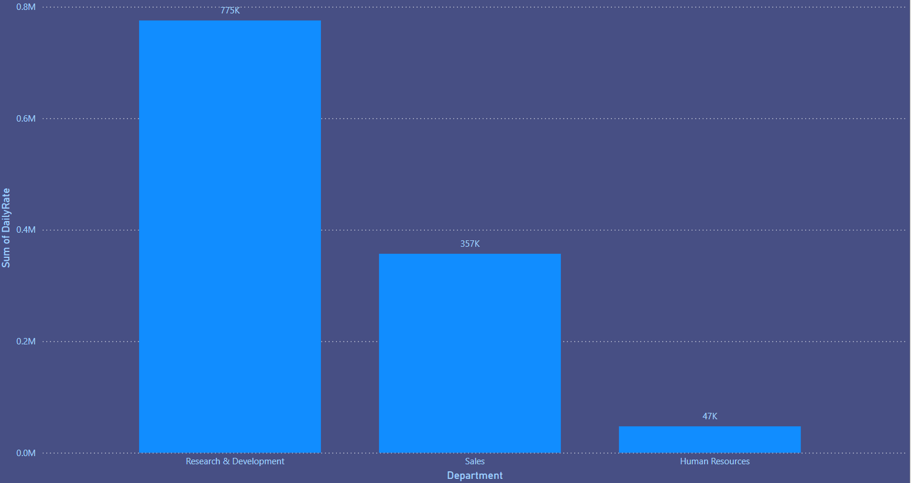
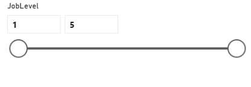

# 📊 HR Employee Attrition Dashboard  
A Power BI HR Analytics dashboard analysing employee attrition, workforce trends, and key HR metrics.

---

## 📁 Project Overview
This project provides a comprehensive HR Analytics dashboard built in **Power BI** to help organisations understand employee attrition, workforce distribution, and compensation patterns.  
It includes:

- Data cleaning and transformation  
- Data modelling  
- DAX measures  
- Interactive visualisations  
- Key HR insights for decision‑making  

---

## 📂 Repository Structure

---

## 📑 Dataset
The dataset contains employee‑level HR information, including:

- Demographics  
- Job level and department  
- Compensation metrics  
- Daily rate, monthly income, hourly rate  
- Attrition status  

This dataset enables analysis of compensation patterns and workforce distribution across departments and job levels.

---

## 🧠 Key Measures & Calculations
Some of the DAX measures used in the report include:

- **Average Hourly Rate**  
- **Sum of Monthly Income**  
- **Sum of Monthly Rate**  
- **Sum of Daily Rate**  
- **Employee Count**  

These measures support the visuals that highlight compensation trends and departmental differences.

---

### 📌 Dashboard Overview

### 📌 KPI Cards

### 📌 Average Hourly Rate by Job Level

### 📌 Department Employee & Income Metrics

### 📌 Daily Rate by Department

### 📌 Slicer Interaction

---

## 🛠 Tools Used
- **Power BI Desktop**  
- **Power Query** (data cleaning)  
- **DAX** (calculations)  
- **Microsoft Excel / CSV** (dataset)  
- **GitHub** (version control & portfolio)

---

## 🔍 Insights Summary
Some insights your dashboard can reveal:

- Compensation increases consistently with job level  
- Certain departments have higher daily and monthly rates  
- Workforce distribution varies significantly across departments  
- Income patterns may correlate with attrition risk (if attrition field is added later)

---

## 📥 Download the Project
- **PBIX File:** `/PowerBI/ATTRITION DASHBOARD.pbix`  
- **Dataset:** `/Data/HR_Employee_Attrition.csv`  
- **Screenshots:** `/Images/`

---

## 🌐 How to Use This Project
1. Download the PBIX file  
2. Open in Power BI Desktop  
3. Explore visuals and slicers  
4. Modify or extend the dashboard as needed  

---

## 💼 LinkedIn Portfolio Summary
**HR Employee Attrition Dashboard — Power BI**  
A full HR analytics dashboard analysing employee compensation, job levels, and departmental trends. Includes data cleaning, modelling, DAX measures, and interactive visuals.  
GitHub Repo: *your repo link here*

